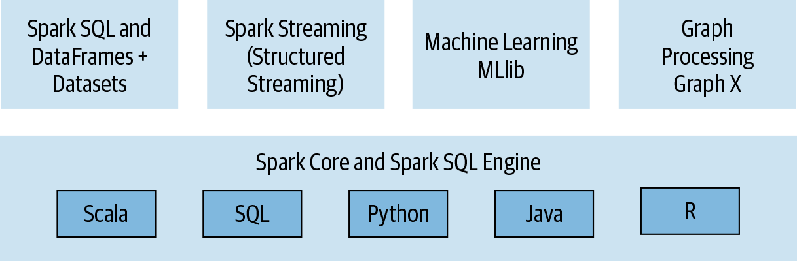
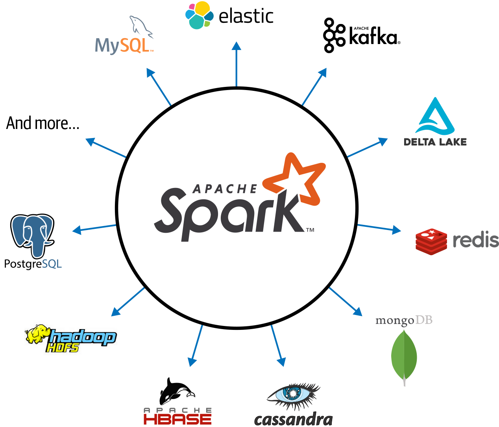
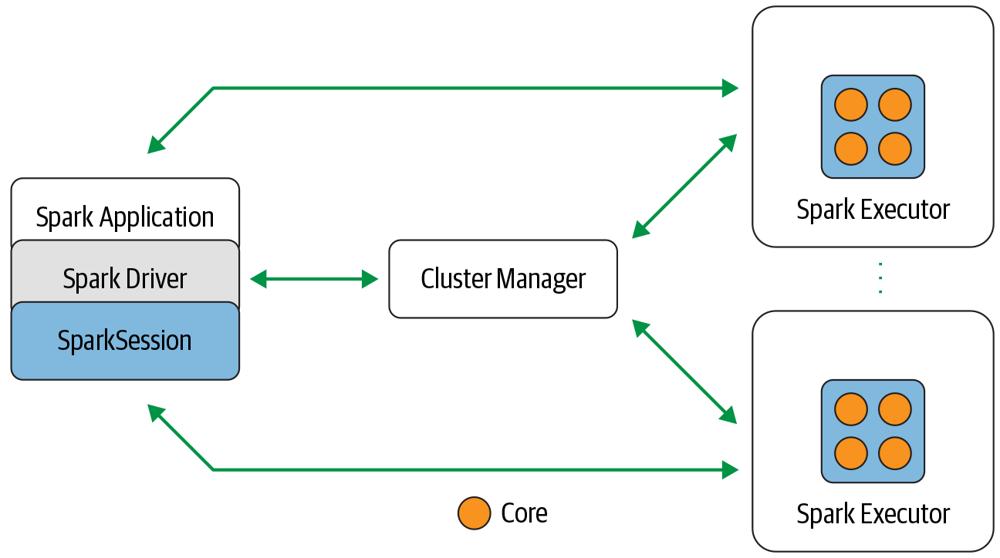
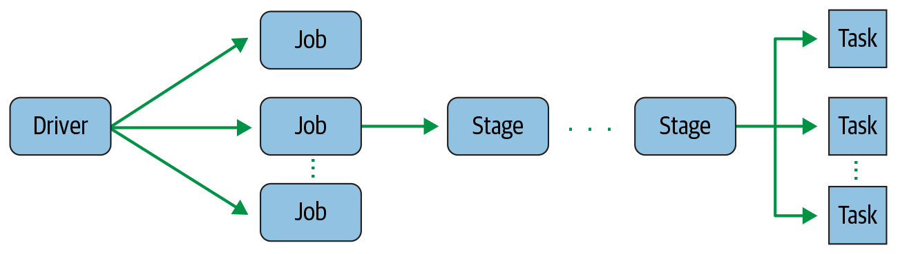
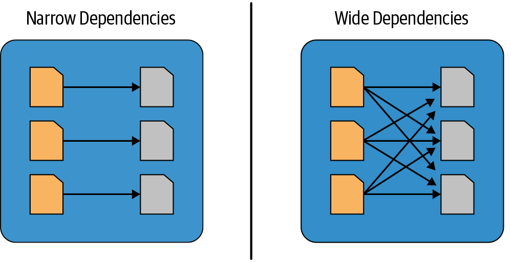
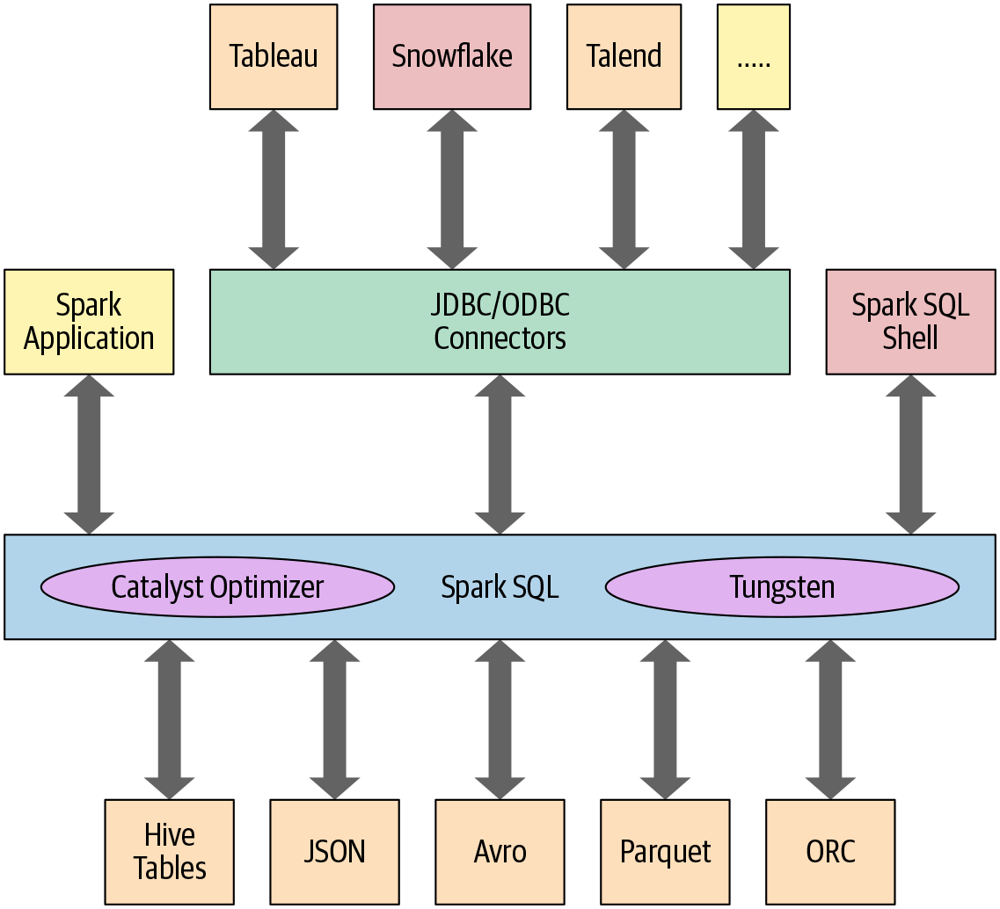
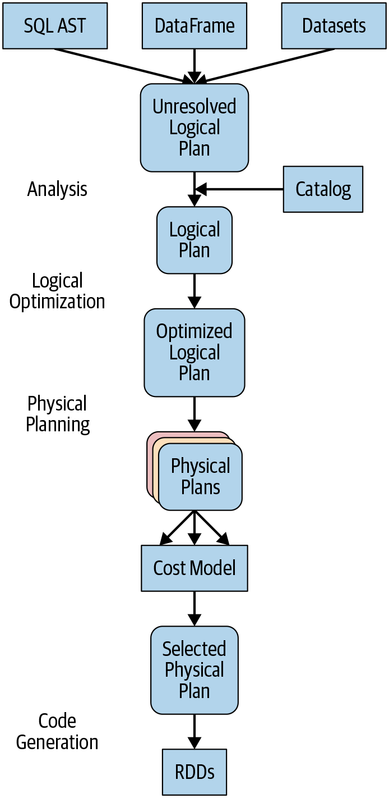

# Spark learning

My learning of Spark is based
on the
book "[Learning Spark: lighting-fast data analytics](https://learning.oreilly.com/library/view/learning-spark-2nd/9781492050032/)".

The authors are co-founder of Databricks and a committer on Apache Spark.

<!-- TOC -->
* [Spark learning](#spark-learning)
  * [Installation](#installation)
  * [Spark components](#spark-components)
  * [Ecosystem](#ecosystem)
  * [Spark architecture](#spark-architecture)
  * [Deployment modes](#deployment-modes)
  * [Get started](#get-started)
    * [Launching Spark (Spark shell)](#launching-spark-spark-shell)
    * [Concepts](#concepts)
    * [Lazy transformations and eager actions](#lazy-transformations-and-eager-actions)
    * [Narrow and Wide Transformations](#narrow-and-wide-transformations)
    * [Spark ui](#spark-ui)
  * [Spark Standalone applications](#spark-standalone-applications)
  * [DataFrame & Dataset](#dataframe--dataset)
    * [Schema](#schema)
    * [Expressions & columns](#expressions--columns)
    * [Rows](#rows)
    * [Common DataFrame operations](#common-dataframe-operations)
  * [Spark SQL](#spark-sql)
    * [Catalyst & Tungsten](#catalyst--tungsten)
      * [The Catalyst Optimizer](#the-catalyst-optimizer)
        * [Debug / Explain SQL](#debug--explain-sql)
    * [SQL & views](#sql--views)
      * [Creating SQL Databases and Tables](#creating-sql-databases-and-tables)
      * [SQL Views](#sql-views)
      * [Spark Catalog](#spark-catalog)
      * [Cache & Lazy](#cache--lazy)
      * [User Defined Functions (UDFs)](#user-defined-functions-udfs)
    * [Spark SQL Shell](#spark-sql-shell)
    * [Other tools: Beeline JDBC / Tableau](#other-tools-beeline-jdbc--tableau)
      * [Beeline](#beeline)
      * [Tableau](#tableau)
  * [DataFrameReader & DataFrameWriter](#dataframereader--dataframewriter)
    * [DataFrameReader](#dataframereader)
    * [DataFrameWriter](#dataframewriter)
    * [Parquet](#parquet)
  * [Connect to external data sources (PostgreSQL)](#connect-to-external-data-sources-postgresql)
    * [Via PySpark](#via-pyspark)
    * [Via Spark Submit with script](#via-spark-submit-with-script)
  * [Common SQL and DataFrame operations](#common-sql-and-dataframe-operations)
    * [Official documentation](#official-documentation)
    * [Examples](#examples)
      * [SQL Array type functions](#sql-array-type-functions)
      * [SQL Array map functions](#sql-array-map-functions)
      * [SQL Higher-Order Functions](#sql-higher-order-functions)
      * [DataFrame functions](#dataframe-functions)
      * [Windowing (SQL and DataFrame)](#windowing-sql-and-dataframe)
      * [Modification (DataFrame)](#modification-dataframe)
      * [Pivoting (SQL and DataFrame)](#pivoting-sql-and-dataframe)
  * [Optimizing and Tuning Spark Applications](#optimizing-and-tuning-spark-applications)
    * [Set Apache Spark Configurations](#set-apache-spark-configurations)
    * [Viewing Configurations](#viewing-configurations)
    * [Tuning](#tuning)
    * [Caching and Persistence of Data](#caching-and-persistence-of-data)
      * [DataFrame.cache()](#dataframecache)
      * [DataFrame.persist()](#dataframepersist)
      * [Cache SQL table](#cache-sql-table)
    * [Join family](#join-family)
<!-- TOC -->

## Installation

Download spark from https://spark.apache.org/downloads.html

And decompress it in this folder.

## Spark components



## Ecosystem



## Spark architecture



* Spark driver is responsible for instantiating a SparkSession, it has multiple
  roles: it communicates with the cluster manager; it requests resources (CPU, memory, etc.) from the cluster manager
  for Spark’s executors (JVMs); and it transforms all the Spark operations into DAG computations, schedules them, and
  distributes their execution as tasks across the Spark executors.
* SparkSession became a unified conduit to all Spark operations and data.
* Cluster manager is responsible for managing and allocating resources for the cluster of nodes on which your Spark
  application runs.
* Spark executors are responsible for executing tasks on the workers.

## Deployment modes

* Local
* Standalone
* YARN
* Kubernetes

## Get started

### Launching Spark (Spark shell)

* `./bin/spark-shell`
* ./bin/pyspark

And to read a file

```sh
scala> val strings = spark.read.text("../README.md")
strings: org.apache.spark.sql.DataFrame = [value: string]

scala> strings.show(10, false)
+------------------------------------------------------------------------------+
|value                                                                         |
+------------------------------------------------------------------------------+
|# Apache Spark                                                                |
|                                                                              |
|Spark is a unified analytics engine for large-scale data processing. It       |
|provides high-level APIs in Scala, Java, Python, and R, and an optimized      |
|engine that supports general computation graphs for data analysis. It also    |
|supports a rich set of higher-level tools including Spark SQL for SQL and     |
|DataFrames, MLlib for machine learning, GraphX for graph processing,          |
| and Structured Streaming for stream processing.                              |
|                                                                              |
|<https://spark.apache.org/>                                                   |
+------------------------------------------------------------------------------+
only showing top 10 rows

scala> strings.count()
res2: Long = 109
```

### Concepts



* Application: A user program built on Spark using its APIs. It consists of a driver program and executors on the
  cluster.
* SparkSession: An object that provides a point of entry to interact with underlying Spark functionality and allows
  programming Spark with its APIs. In an interactive Spark shell, the Spark driver instantiates a SparkSession for you,
  while in a Spark application, you create a SparkSession object yourself.
* Job: A parallel computation consisting of multiple tasks that gets spawned in response to a Spark action (e.g.,
  save(), collect()).
* Stage: Each job gets divided into smaller sets of tasks called stages that depend on each other.
* Task: A single unit of work or execution that will be sent to a Spark executor.

NB: RDD (Resilient Distributed Dataset) is a Spark abstraction that represents an immutable distributed collection of
objects that can be processed in parallel.

### Lazy transformations and eager actions

Transformations are lazy, and wait an action to be executed.

Transformations are filter, map, reduce, etc.

Actions are collect, count, etc.

Example in Python

```sh
# In Python 
>>> strings = spark.read.text("../README.md") # => lazy
>>> filtered = strings.filter(strings.value.contains("Spark")) # => lazy
>>> filtered.count() # => eager
20
```

### Narrow and Wide Transformations



Transformations can be classified into:

* narrow transformations: `filter()`, `contains()`
* wide transformations. `groupBy()`, `orderBy()`

### Spark ui

To inspect Spark applications: http://localhost:4040/

THe UI is launched by the driver.

We can also add eventLog parameters to record the events and read the logs in Spark ui
with `./sbin/start-history-server.sh`.

## Spark Standalone applications

Code is in `chapter2-mnmcount/`:

* script `mnmcount.py`

To launch the application:

```sh
cd spark-4.1.1-bin-hadoop3/
./../spark-4.1.1-bin-hadoop3/bin/spark-submit \
  --conf spark.eventLog.enabled=true \ # important to record the events and read the logs
  --conf spark.eventLog.dir=file:/tmp/spark-events \
  mnmcount.py mnm_dataset.csv
```

Read the log in Spark ui by executing

```shell
cd /home/reboulleau/repos/discover-spark/spark-4.1.1-bin-hadoop3
./sbin/start-history-server.sh
```

We can see the DAG, execution time, tasks, stages, etc.

## DataFrame & Dataset

DataFrame is a distributed collection of rows and columns like a column.

* DataFrame = table with named column, like SQL
* Dataset[T] = typed collection with Java/Scala objects

To resume in Scala/Java, a DataFrame is a Dataset[Row]

So:

* DataFrame → useful for handle columns
* Dataset → useful when you want strong typing with Scala/Java classes

In Python, you mostly use DataFrames: the typed `Dataset[T]` API is not really available in PySpark

> In Spark’s supported languages, Datasets make sense only in Java and Scala, whereas in Python and R only DataFrames
> make sense. This is because Python and R are not compile-time type-safe

### Schema

**schema** in Spark defines the column names and associated data types for a DataFrame. (allow to type our data)

```python
# Show the DataFrame; it should reflect our table above
blogs_df.show()
# Print the schema used by Spark to process the DataFrame
print(blogs_df.printSchema())
```

### Expressions & columns

We can compute values using expressions.

```sh
// Use an expression to compute a value
scala> blogsDF.select(expr("Hits * 2")).show(2)
// or use col to compute value
scala> blogsDF.select(col("Hits") * 2).show(2)
```

### Rows

```python
# In Python
from pyspark.sql import Row

blog_row = Row(6, "Reynold", "Xin", "https://tinyurl.6", 255568, "3/2/2015",
               ["twitter", "LinkedIn"])
# access using index for individual items
blog_row[1]
'Reynold'
```

**Important:**

* DataFrame is immutable.
* Spark keeps a lineage of all transformations. That means it can replay all transformations to reconstruct the original
  DataFrame. => **Resilient to failures.**

### Common DataFrame operations

Read CSV and write Parquet in Hive tables.

See `chapter3-input-csv-output-parquet-hive/` folder.

**Prerequisite:**

* download the CSV from https://data.sfgov.org/Public-Safety/Fire-Incidents/wr8u-xric/data_preview

To launch the application:

```sh
mkdir /tmp/spark-events
cd chapter3-input-csv-output-parquet-hive/input-csv-output-parquet-hive/
./../../spark-4.1.1-bin-hadoop3/bin/spark-submit \
  --conf spark.eventLog.enabled=true \ # important to record the events and read the logs
  --conf spark.eventLog.dir=file:/tmp/spark-events \
  transform-csv-to-hive.py
```

## Spark SQL

Apart from allowing you to issue SQL-like queries on your data, the Spark SQL engine:

* Unifies Spark components and permits abstraction to DataFrames/Datasets in Java, Scala, Python, and R, which
  simplifies working with structured data sets.
* Connects to the Apache Hive metastore and tables.
* Reads and writes structured data with a specific schema from structured file formats (JSON, CSV, Text, Avro, Parquet,
  ORC, etc.) and converts data into temporary tables.
* Offers an interactive Spark SQL shell for quick data exploration.
* Provides a bridge to (and from) external tools via standard database JDBC/ODBC connectors.
* Generates optimized query plans and compact code for the JVM, for final execution.



### Catalyst & Tungsten

* Catalyst = request optimizer
* Tungsten = query engine to execute query in low level with high performance

#### The Catalyst Optimizer

4 transformations phases:

* Analysis
* Logical optimization
* Physical planning
* Code generation (Tungsten) => generate efficient Java bytecode to run on each machine



##### Debug / Explain SQL

* `count_mnm_df.explain(True)`
* logical plan: `df.queryExecution.logical`
* Physical plan: `df.queryExecution.optimizedPlan`

WE can set a mode `joinedDF.explain('mode')` to display a readable and digestible output. 

The modes include `simple`, `extended`, `codegen`, `cost`, and `formatted`.

In practice, see `chapter3/catalyst-optimizer-explain/sql-explain.py`:

```shell
mkdir /tmp/spark-events
cd chapter3/catalyst-optimizer-explain/
./../../spark-4.1.1-bin-hadoop3/bin/spark-submit \
  --conf spark.eventLog.enabled=true \ # important to record the events and read the logs
  --conf spark.eventLog.dir=file:/tmp/spark-events \
  sql-explain.py
```

Output:

```console
== Parsed Logical Plan ==
'Sort ['sum(Count) DESC NULLS LAST], true
+- Aggregate [State#17, Color#18], [State#17, Color#18, sum(Count#19) AS sum(Count)#25L]
   +- Filter (State#17 = CA)
      +- Project [State#17, Color#18, Count#19]
         +- Relation [State#17,Color#18,Count#19] csv

== Analyzed Logical Plan ==
State: string, Color: string, sum(Count): bigint
Sort [sum(Count)#25L DESC NULLS LAST], true
+- Aggregate [State#17, Color#18], [State#17, Color#18, sum(Count#19) AS sum(Count)#25L]
   +- Filter (State#17 = CA)
      +- Project [State#17, Color#18, Count#19]
         +- Relation [State#17,Color#18,Count#19] csv

== Optimized Logical Plan ==
Sort [sum(Count)#25L DESC NULLS LAST], true
+- Aggregate [State#17, Color#18], [State#17, Color#18, sum(Count#19) AS sum(Count)#25L]
   +- Filter (isnotnull(State#17) AND (State#17 = CA))
      +- Relation [State#17,Color#18,Count#19] csv

== Physical Plan ==
AdaptiveSparkPlan isFinalPlan=false
+- Sort [sum(Count)#25L DESC NULLS LAST], true, 0
   +- Exchange rangepartitioning(sum(Count)#25L DESC NULLS LAST, 200), ENSURE_REQUIREMENTS, [plan_id=44]
      +- HashAggregate(keys=[State#17, Color#18], functions=[sum(Count#19)], output=[State#17, Color#18, sum(Count)#25L])
         +- Exchange hashpartitioning(State#17, Color#18, 200), ENSURE_REQUIREMENTS, [plan_id=41]
            +- HashAggregate(keys=[State#17, Color#18], functions=[partial_sum(Count#19)], output=[State#17, Color#18, sum#27L])
               +- Filter (isnotnull(State#17) AND (State#17 = CA))
                  +- FileScan csv [State#17,Color#18,Count#19] Batched: false, DataFilters: [isnotnull(State#17), (State#17 = CA)], Format: CSV, Location: InMemoryFileIndex(1 paths)[file:/home/reboulleau/repos/discover-spark/chapter2-mnmcount/mnm_datas..., PartitionFilters: [], PushedFilters: [IsNotNull(State), EqualTo(State,CA)], ReadSchema: struct<State:string,Color:string,Count:int>
```

### SQL & views

> Instead of having a separate metastore for Spark tables, Spark by default uses the Apache Hive metastore, located at
> /user/hive/warehouse, to persist all the metadata about your tables.

> For a managed table, Spark manages both the metadata and the data in the file store. This could be a local filesystem,
> HDFS, or an object store such as Amazon S3 or Azure Blob. For an unmanaged table, Spark only manages the metadata,
> while
> you manage the data yourself in an external data source such as Cassandra.

#### Creating SQL Databases and Tables

Create a database and use it:

```shell
spark.sql("CREATE DATABASE learn_spark_db")
spark.sql("USE learn_spark_db")
```

Create a table in Spark shell (Spark SQL):

```shell
spark.sql("CREATE TABLE managed_us_delay_flights_tbl (date STRING, delay INT, distance INT, origin STRING, destination STRING)")
```

Or Python DataFrame

```python
# In Python
# Path to our US flight delays CSV file 
csv_file = "/databricks-datasets/learning-spark-v2/flights/departuredelays.csv"
# Schema as defined in the preceding example
schema = "date STRING, delay INT, distance INT, origin STRING, destination STRING"
flights_df = spark.read.csv(csv_file, schema=schema)
flights_df.write.saveAsTable("managed_us_delay_flights_tbl")
```

#### SQL Views

```shell
spark.sql("CREATE OR REPLACE GLOBAL TEMP VIEW us_origin_airport_SFO_global_tmp_view AS
  SELECT date, delay, origin, destination from us_delay_flights_tbl WHERE 
  origin = 'SFO';")
spark.sql("SELECT * FROM us_origin_airport_JFK_tmp_view")
```

**Temporary views versus global temporary views**

* Temporary views are only visible within the current Spark session.
* Global temporary views are visible across Spark sessions.

#### Spark Catalog

> Spark manages the metadata associated with each managed or unmanaged table. This is captured in the Catalog

```shell
spark.catalog.listDatabases().show()
spark.catalog.listTables().show()
spark.catalog.listColumns("us_delay_flights_tbl").show()
```

#### Cache & Lazy

We can create cache for a table, and optionally cache the data in lazy mode, that means we cache only at the first
access.

```shell
CACHE [LAZY] TABLE <table-name>
UNCACHE TABLE <table-name>
```

#### User Defined Functions (UDFs)

```python
# Register UDF
spark.udf.register("cubed", cubed, LongType())

# Generate temporary view
spark.range(1, 9).createOrReplaceTempView("udf_test")

# Now we can use this new function "cubed"
spark.sql("SELECT id, cubed(id) AS id_cubed FROM udf_test").show()
```

**Pay attention to the performance of UDFs with Python:**
This was because the PySpark UDFs required data movement between the JVM and Python

-> Use Panda UDF

Two options with Kubernetes Spark operator:

* UDF Python libraries are installed in the Notebook
* Persistent UDF (CREATE FUNCTION in the external catalog + artefact (JAR))

```python
# In Python
# Import pandas
import pandas as pd

# Import various pyspark SQL functions including pandas_udf
from pyspark.sql.functions import col, pandas_udf
from pyspark.sql.types import LongType


# Declare the cubed function 
def cubed(a: pd.Series) -> pd.Series:
    return a * a * a


# Create the pandas UDF for the cubed function 
cubed_udf = pandas_udf(cubed, returnType=LongType())

# Create a Pandas Series
x = pd.Series([1, 2, 3])

# The function for a pandas_udf executed with local Pandas data
print(cubed(x))

# Create a Spark DataFrame, 'spark' is an existing SparkSession
df = spark.range(1, 4)

# Execute function as a Spark vectorized UDF
df.select("id", cubed_udf(col("id"))).show()
```

### Spark SQL Shell

```shell
./bin/spark-sql
```

```sql
spark
-sql>
CREATE TABLE people
(
    name STRING,
    age  int
);
spark
-sql> INSERT INTO people VALUES ("Alice", 34);
spark
-sql>
SELECT *
FROM people;
```

### Other tools: Beeline JDBC / Tableau

#### Beeline

```shell
# Start the server
./sbin/start-thriftserver.sh
# Connect to the Thrift server via Beeline
./bin/beeline
# Execute a Spark SQL query with Beeline
0: jdbc:hive2://localhost:10000> SHOW tables;
```

#### Tableau

```shell
# Start the server
./sbin/start-thriftserver.sh
````

And start Tableau and connect to the Thrift server with the JDBC connector.
This is a UI tool to explore the data and create dashboards.

## DataFrameReader & DataFrameWriter

### DataFrameReader

We can specify format, options, schema, etc.

Spark can read CSV, JSON, Parquet, ORC, etc.
The default format is Parquet.

```Scala
// In Scala
// Use Parquet
val file = """/databricks-datasets/learning-spark-v2/flights/summary-
  data/parquet/2010-summary.parquet"""
val df = spark.read.format("parquet").load(file)
// Use Parquet; you can omit format("parquet") if you wish as it 's the default
val df2 = spark.read.load(file)
// Use CSV
val df3 = spark.read.format("csv")
    .option("inferSchema", "true")
    .option("header", "true")
    .option("mode", "PERMISSIVE")
    .load("/databricks-datasets/learning-spark-v2/flights/summary-data/csv/*")
// Use JSON
val df4 = spark.read.format("json")
    .load("/databricks-datasets/learning-spark-v2/flights/summary-data/json/*")
```

### DataFrameWriter

```python
DataFrameWriter.format(args)
.option(args)
.bucketBy(args)
.partitionBy(args)
.save(path)

DataFrameWriter.format(args).option(args).sortBy(args).saveAsTable(table)
```

* format: Parquet, CSV, JSON, etc.
* option:
  ```txt
  ("mode", {append | overwrite | ignore | error or errorifexists} )
  ("mode", {SaveMode.Overwrite | SaveMode.Append, SaveMode.Ignore, SaveMode.ErrorIfExists})
  ("path", "path_to_write_to")
  ```

### Parquet

**Reading Parquet files into a Spark SQL table**

```sql
CREATE
OR REPLACE TEMPORARY VIEW us_delay_flights_tbl
    USING parquet
    OPTIONS (
      path "/databricks-datasets/learning-spark-v2/flights/summary-data/parquet/
      2010-summary.parquet/" )
```

```shell
spark.sql("SELECT * FROM us_delay_flights_tbl").show()
```

**Write in Parquet**

```python
# In Python
(df.write.format("parquet")
 .mode("overwrite")
 .option("compression", "snappy")
 .save("/tmp/data/parquet/df_parquet"))
```

**Writing DataFrames to Spark SQL tables**

```python
(df.write
 .mode("overwrite")
 .saveAsTable("us_delay_flights_tbl"))
```

## Connect to external data sources (PostgreSQL)

Download the driver from Maven repository: https://mvnrepository.com/artifact/org.postgresql/postgresql

### Via PySpark

```shell
./pyspark --jars postgresql-42.7.11.jar
```

```python
# Lire une table
df = (spark.read
      .format("jdbc")
      .option("url", "jdbc:postgresql://localhost:5432/insight_db")
      .option("dbtable", "public.systems_information")
      .option("user", "postgres")
      .option("password", "xxx")
      .option("driver", "org.postgresql.Driver")
      .load())

# Vérifier le schéma
df.printSchema()

# Afficher les 10 premières lignes
df.show(10)

# Créer une vue temporaire pour requêter en SQL
df.createOrReplaceTempView("systems_information")

spark.sql("SELECT * FROM systems_information WHERE ...").show()
```

=> Test ok

### Via Spark Submit with script

```shell
./bin/spark-submit \
  --jars ../postgresql-42.7.4.jar \
  mon_script.py
```

Script

```python
from pyspark.sql import SparkSession

spark = (SparkSession.builder
         .appName("postgres-local")
         .config("spark.jars",
                 "/home/reboulleau/repos/discover-spark/spark-4.1.1-bin-hadoop3/bin/postgresql-42.7.4.jar")
         .getOrCreate())

df = (spark.read
      .format("jdbc")
      .option("url", "jdbc:postgresql://localhost:5432/ma_base")
      .option("dbtable", "public.ma_table")
      .option("user", "postgres")
      .option("password", "xxx")
      .option("driver", "org.postgresql.Driver")
      .load())

df.printSchema()
df.show(10)
```

## Common SQL and DataFrame operations

### Official documentation

* Spark SQL documentation: https://spark.apache.org/docs/latest/api/sql/index.html#lead

### Examples

#### SQL Array type functions

* `array_distinct()`
* `array_except()`
* `array_intersect()`
* `array_union()`
* `array_join()`
* `array_max()`
* `array_min()`
* `array_position()`
* `array_remove()`
* `arrays_overlap()`
* `array_sort()`
* `concat()`
* etc

#### SQL Array map functions

* `map_form_arrays()`
* `map_from_entries()`
* `map_concat()`
* `element_at()`
* `cardinality()`

#### SQL Higher-Order Functions

* `transform(values, value -> lambda expression)`
* `filter(values, value -> lambda expression)`
* `exists(values, value -> lambda expression)`
* `reduce(values, acc -> lambda expression, initialValue)`

#### DataFrame functions

* `df1.union(df2)`
* `df1.join(df2)`

#### Windowing (SQL and DataFrame)

| Type         | SQL              | DataFrame API   |
|--------------|------------------|-----------------|
| **Ranking**  | `rank()`         | `rank()`        |
|              | `dense_rank()`   | `denseRank()`   |
|              | `percent_rank()` | `percentRank()` |
|              | `ntile()`        | `ntile()`       |
|              | `row_number()`   | `rowNumber()`   |
| **Analytic** | `cume_dist()`    | `cumeDist()`    |
|              | `first_value()`  | `firstValue()`  |
|              | `last_value()`   | `lastValue()`   |
|              | `lag()`          | `lag()`         |
|              | `lead()`         | `lead()`        |

#### Modification (DataFrame)

* Adding new columns: `df.withColumn("new_column", expr("existing_column * 2"))`
* Renaming columns: `df.withColumnRenamed("old_name", "new_name")`
* Dropping columns: `df.drop("column_to_drop")`

#### Pivoting (SQL and DataFrame)

When we would like to transform rows into columns, we can use pivoting.

```sql
-- In SQL
SELECT *
FROM (SELECT destination, CAST(SUBSTRING(date, 0, 2) AS int) AS month, delay
      FROM departureDelays
      WHERE origin = 'SEA') PIVOT (
                                   CAST(AVG(delay) AS DECIMAL(4, 2)) AS AvgDelay, MAX(delay) AS MaxDelay
  FOR month IN (1 JAN, 2 FEB)
    )
ORDER BY destination
```

```python
from pyspark.sql import SparkSession
from pyspark.sql.functions import sum

spark = SparkSession.builder.getOrCreate()

data = [
    (2023, "Q1", 100), (2023, "Q2", 150),
    (2023, "Q3", 120), (2023, "Q4", 200),
    (2024, "Q1", 110), (2024, "Q2", 160),
]
df = spark.createDataFrame(data, ["year", "quarter", "revenue"])

# Pivot : groupBy year, pivoter sur quarter, agréger revenue
pivot_df = (df
            .groupBy("year")
            .pivot("quarter")  # valeurs de quarter → colonnes
            .agg(sum("revenue")))  # valeur dans chaque cellule

pivot_df.show()
# +----+----+----+----+----+
# |year|  Q1|  Q2|  Q3|  Q4|
# +----+----+----+----+----+
# |2023| 100| 150| 120| 200|
# |2024| 110| 160|null|null|
```

## Optimizing and Tuning Spark Applications

### Set Apache Spark Configurations

1. $SPARK_HOME

* conf/spark-defaults.conf(.template)
* conf/log4j.properties(.template)
* conf/spark-env.sh(.template)

2. Spark configuration in Spark application
3. Or by --conf flag in spark-submit
4. Through the SparkSession in the code

**Modifiable configurations:**

* `spark.conf.isModifiable("<config_name>")`

### Viewing Configurations

**Scala**

```scala
// In Scala
// mconf is a Map[String, String] 
scala> val mconf = spark.conf.getAll
scala> for (k <- mconf.keySet) { println(s"${k} -> ${mconf(k)}\n") }
>>> spark.conf.get("spark.sql.shuffle.partitions")

```

**SQL**

```python
# In Python
spark.sql("SET -v").select("key", "value").show(n=5, truncate=False)
```

**Or through the Spark UI**

### Tuning

Let the default configurations if everything is working fine.

Otherwise, we can tune the Spark application by following recommendations in the book chapter 7 "7. Optimizing and
Tuning Spark Applications".

We can tune memmory for:
* Spark driver
* Spark executor
* Spark shuffle

Maximize the number of executors.

And optimize the number of partitions to reduce I/O.

### Caching and Persistence of Data

#### DataFrame.cache()

```scala
// In Scala
// Create a DataFrame with 10M records
val df = spark.range(1 * 10000000).toDF("id").withColumn("square", $"id" * $"id")
df.cache() // Cache the data
df.count() // Materialize the cache

res3: Long = 10000000
Command took 5.11 seconds

df.count() // Now get it from the cache
res4: Long = 10000000
Command took 0.44 seconds
```

#### DataFrame.persist()

| StorageLevel        | Description                                                                                                                                                   |
|---------------------|---------------------------------------------------------------------------------------------------------------------------------------------------------------|
| MEMORY_ONLY         | Data is stored directly as objects and stored only in memory.                                                                                                 |
| MEMORY_ONLY_SER     | Data is serialized as compact byte array representation and stored only in memory. To use it, it has to be deserialized at a cost.                            |
| MEMORY_AND_DISK     | Data is stored directly as objects in memory, but if there’s insufficient memory the rest is serialized and stored on disk.                                   |
| DISK_ONLY           | Data is serialized and stored on disk.                                                                                                                        |
| OFF_HEAP            | Data is stored off-heap. Off-heap memory is used in Spark for storage and query execution; see “Configuring Spark executors’ memory and the shuffle service”. |
| MEMORY_AND_DISK_SER | Like MEMORY_AND_DISK, but data is serialized when stored in memory. (Data is always serialized when stored on disk.)                                          |


```scala
// In Scala
import org.apache.spark.storage.StorageLevel

// Create a DataFrame with 10M records
val df = spark.range(1 * 10000000).toDF("id").withColumn("square", $"id" * $"id")
df.persist(StorageLevel.DISK_ONLY) // Serialize the data and cache it on disk
df.count() // Materialize the cache

res2: Long = 10000000
Command took 2.08 seconds

df.count() // Now get it from the cache 
res3: Long = 10000000
Command took 0.38 seconds
```

#### Cache SQL table

```scala
// In Scala
df.createOrReplaceTempView("dfTable")
spark.sql("CACHE TABLE dfTable")
spark.sql("SELECT count(*) FROM dfTable").show()

+--------+
|count(1)|
+--------+
|10000000|
+--------+

Command took 0.56 seconds
```

### Join family

It exists five types of joins strategiesby which it exchanges, moves, sorts, groups, and merges data across executors: 
* the broadcast hash join (BHJ)
* shuffle hash join (SHJ)
* shuffle sort merge join (SMJ)
* broadcast nested loop join (BNLJ)
* shuffle-and-replicated nested loop join

